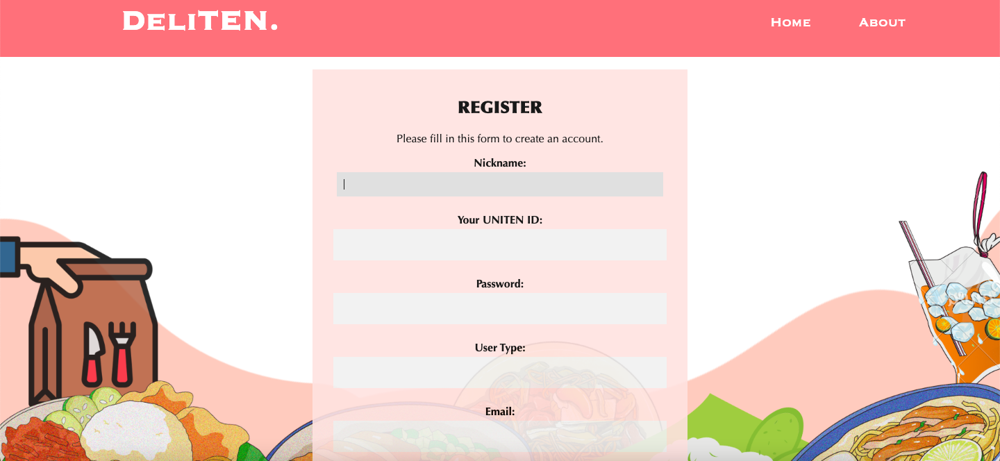
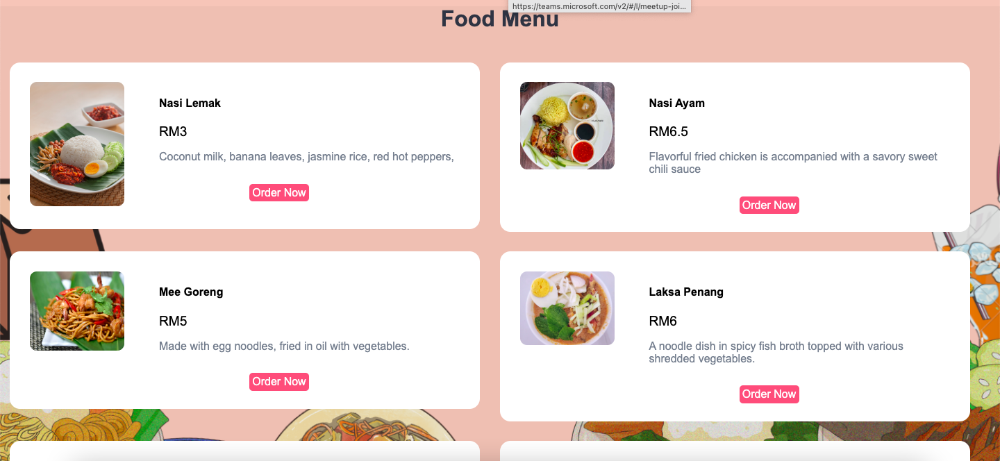

# 🍔 DeliTEN Online Food Ordering System

A web-based food delivery system developed during my **Diploma 2022 at Universiti Tenaga Nasional (UNITEN)**.  
It allows students and staff to browse menus, place orders online, and enjoy convenient delivery within campus.

---

## ✨ Features
- 👤 User Roles: Admin, Customer  
- 🛒 Food menu browsing & shopping cart  
- 💳 Online order & checkout system  
- 📦 Order tracking with real-time status updates  
- ⚙️ Vendor(Admin) panel to manage food items  
- 🔐 Secure login & registration  

---
- **Frontend:** HTML, CSS  
- **Backend:** PHP  
- **Database:** MySQL  
- **IDE:** Visual Studio Code  
- **Local Server:** XAMPP  

---

## 📂 Project Structure
### Login Page

### Menu Page

